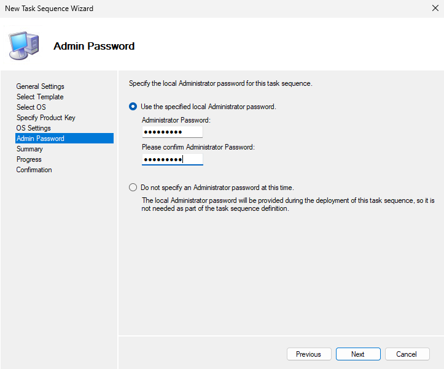

# 📘 Montando um `CustomSettings.ini` eficiente

Este documento tem como objetivo orientar profissionais de TI sobre a estrutura, função e manutenção segura do arquivo `CustomSettings.ini` utilizado no Microsoft Deployment Toolkit (MDT).

---

## 📌 O que é o `CustomSettings.ini`?

O `CustomSettings.ini` é um dos principais arquivos de configuração do MDT. Ele define como os deployments devem se comportar, aplicando regras e parâmetros automaticamente durante a instalação do sistema operacional, aplicativos e configurações personalizadas.

Neste documento, exploraremos o arquivo `CustomSettings.ini` que utilizo em meu ambiente de testes. Acredito que contempla uma configuração abrangente, repleta de recursos e ajustes que refletem boas práticas e melhorias implementadas que podem servir como referência útil e adaptável para aprimorar também o seu ambiente de implantação:

```CustomSettings.ini
[Settings]
Priority=Init, ByDesktop, ByLaptop, ByVirtual, Default
Properties=MyCustomProperty, ComputerSerialNumber, ComputerTypeName, ComputerPrefix, VMPlatform

[Init]
ComputerSerialNumber=#Right("%SerialNumber%",9)#

[ByLaptop]
Subsection=Laptop-%IsLaptop%

[ByDesktop]
Subsection=Desktop-%IsDesktop%

[ByVirtual]
Subsection=Virtual-%IsVM%

[Virtual-True]
Subsection=VM-%VMPlatform%

[VMPlatform]
VMPlatform=Unknown
VMPlatform=#IfStrIEquals("%Model%", "VMware Virtual Platform") Then "VMware" ElseIfStrIEquals("%Model%", "VirtualBox") Then "VirtualBox" ElseIfStrIEquals("%Model%", "Virtual Machine") Then "Hyper-V" Else "Unknown"#

[VM-VMware]
ComputerTypeName=V
ComputerPrefix=VMW

[VM-VirtualBox]
ComputerTypeName=V
ComputerPrefix=VBX

[VM-Unknown]
ComputerTypeName=V
ComputerPrefix=VMU

[Desktop-True]
ComputerTypeName=D
ComputerPrefix=DSK

[Laptop-True]
ComputerTypeName=L
ComputerPrefix=NTB

[Default]
OSInstall=Y
_SMSTSOrgName=SUPORTE TI
_SMSTSPackageName=%TaskSequenceID% on %OSDComputername%
SkipCapture=YES
SkipAdminPassword=YES
AdminPassword=Teste@123
SkipDeploymentType=YES
SkipProductKey=YES
SkipComputerBackup=YES
SkipBitLocker=YES
SkipComputerName=NO
SkipTaskSequence=NO
SkipUserData=YES
OSDComputerName=%ComputerPrefix%-%ComputerSerialNumber%
SkipPackageDisplay=NO
SkipLocaleSelection=NO
KeyboardLocale=0416:00010416
SkipTimeZone=YES
TimeZone=065
TimeZoneName=E. South America Standard Time
BitsPerPel=32
VRefresh=60
XResolution=1
YResolution=1
SkipSummary=YES
SkipFinalSummary=NO
SLShareDynamicLogging=\\SRV-2025-RJ\deploymentshare$\DeploymentLogs
SLShare=\\SRV-2025-RJ\deploymentshare$\CompletedDeployments
EventService=http://SRV-2025-RJ:9800
WSUSServer=http://SRV-2025-RJ:8530
FinishAction=REBOOT
```

---

## 🧱 Estrutura Geral do Arquivo

O arquivo está organizado por seções com regras de prioridade e subseções específicas. Abaixo estão os principais elementos:

### `[Settings]`
Define a ordem de prioridade da aplicação das regras:
```ini
Priority=Init, ByDesktop, ByLaptop, ByVirtual, Default
```
**Essa ordem é importante** — regras em `Init` têm prioridade sobre as seguintes.

---

## 🔍 Seções Explicadas

### `Init`
Executa no início da execução do MDT. Aqui, é calculado o número de série personalizado:
```ini
ComputerSerialNumber=#Right("%SerialNumber%",9)#
```
**Ideal** para otimizar ambientes corporativos em que o nome da estação de trabalho utiliza o serial number ou service tag (Dell) do equipamento.

---

### `ByLaptop` / `ByDesktop` / `ByVirtual`
Define subseções baseadas no tipo de hardware detectado.

- `IsLaptop=True` → seção `Laptop-True`
- `IsDesktop=True` → seção `Desktop-True`
- `IsVM=True` → seção `Virtual-True`

**Evite editar a lógica dessas seções.** Apenas altere caso novos cenários de hardware sejam incluídos no ambiente.

---

### `Virtual-True` + `VMPlatform`
Aponta para a plataforma de virtualização detectada:
```ini
VMPlatform=#IfStrIEquals("%Model%", "VMware Virtual Platform") Then "VMware" ElseIfStrIEquals("%Model%", "VirtualBox") Then "VirtualBox" ElseIfStrIEquals("%Model%", "Virtual Machine") Then "Hyper-V" Else "Unknown"#
```

- Detecta automaticamente se é VMware, VirtualBox ou Hyper-V.
- Com base nisso, aplica prefixos e nomes de computador diferentes.

**Ideal** para ambientes de testes padronizando assim, o nome das máquinas virtuais criadas.

---

### `VM-<Plataforma>`
Define prefixos para máquinas virtuais:
```ini
[VM-VMware]
ComputerTypeName=V
ComputerPrefix=VMW
```

Você pode **editar os prefixos**, caso queira padronizar com outros códigos.

---

### `Desktop-True` / `Laptop-True`
Define configurações de nomenclatura:
```ini
ComputerPrefix=DSK  ; para desktops
ComputerPrefix=NTB  ; para notebooks
```

**Edite apenas os sufixos `DSK`, `NTB`, etc., se necessário.** Isso impacta diretamente o nome dos computadores gerados.

---

### `Default`
Contém as configurações padrão aplicadas se nenhuma outra regra se encaixar.

Entre os destaques:
- Senha de administrador (⚠️ cuidado!)
> - **EVITE** definir a senha de administrador diretamente no arquivo `CustomSettings.ini`. O método mais seguro e recomendável é configurar essa credencial durante a criação da `Task Sequence` (conforme imagem a seguir). Essa prática contribui significativamente para o cumprimento das diretrizes de segurança e compliance da organização.
> - No arquivo `CustomSettings.ini` apresentado neste documento, a definição da senha de administrador foi mantida **intencionalmente** com o propósito de destacar este ponto crítico

<p align="center">  
  <kbd></kbd>  
</p>

- Nome automático do computador com base em prefixo e serial:
  ```ini
  OSDComputerName=%ComputerPrefix%-%ComputerSerialNumber%
  ```
- Localização, resolução de tela, nome da organização
- Logs e ações pós-instalação

---

## 🛑 O que **não editar** sem aprovação técnica

- Qualquer linha que use `#IfStrIEquals(...)#` (lógica condicional)
- Variáveis como `%SerialNumber%`, `%Model%`, `%IsVM%`, `%TaskSequenceID%`
- Seções de log (`SLShareDynamicLogging`, `SLShare`) e serviços (`EventService`)
- Sequência de prioridade (`Priority=`)

---

## ✅ O que **pode ser customizado**

- Prefixos (`ComputerPrefix=`)
- Nome da organização (`_SMSTSOrgName`)
- Resolução, idioma do teclado, fuso horário

---

## 🔒 Boas Práticas

- Faça backup do arquivo antes de qualquer alteração.
- Comente qualquer linha alterada usando `;` e adicione data + responsável.
- Teste sempre as mudanças em ambiente isolado (VM de homologação).
- Verifique logs de execução no compartilhamento definido por `SLShareDynamicLogging`.

---
