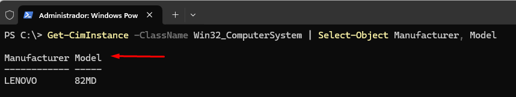
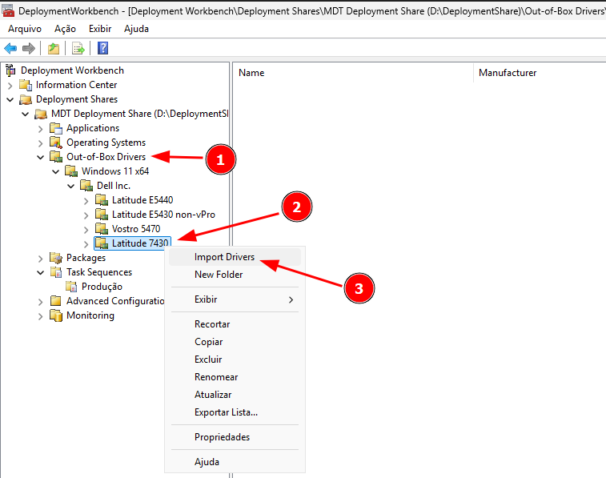
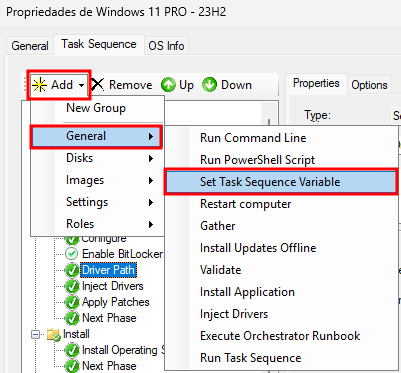
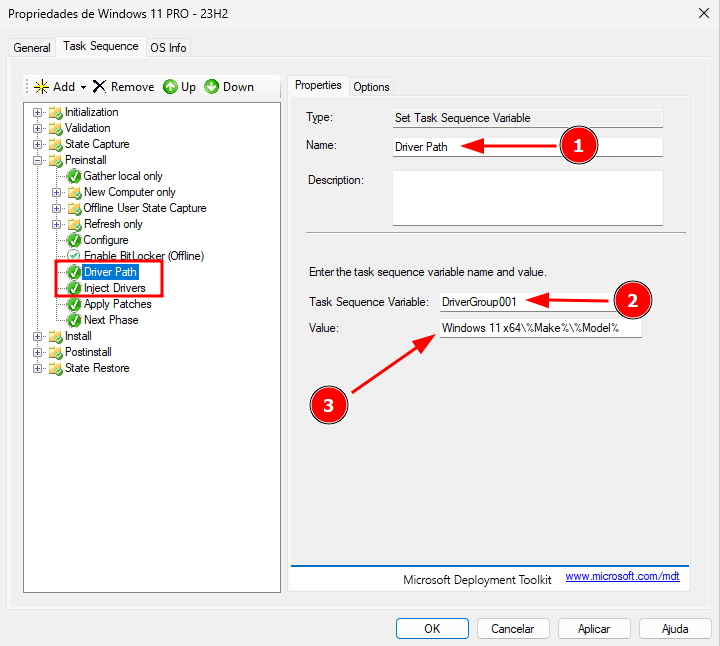
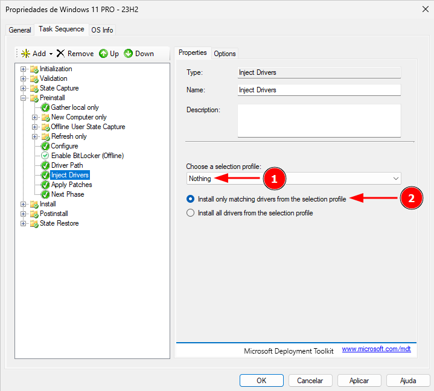
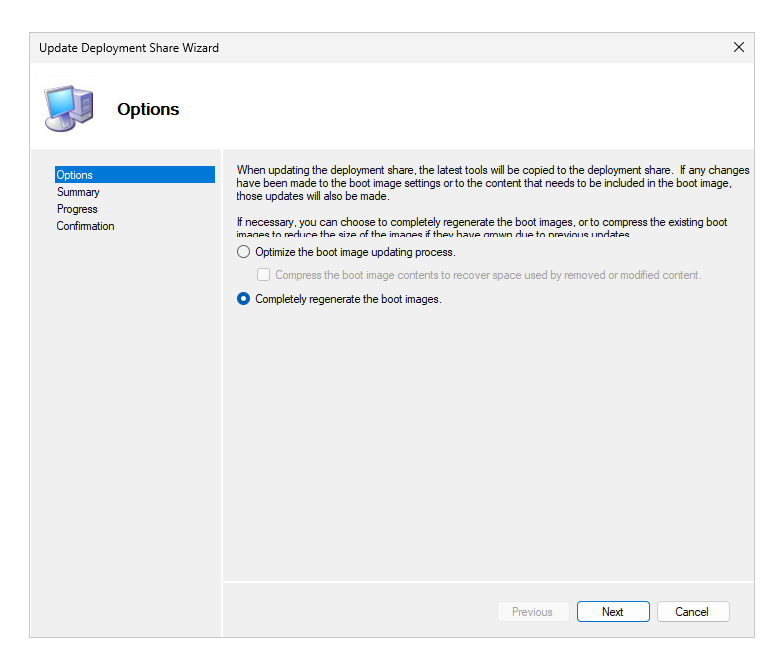

# Configuração de Drivers por Modelo e Fabricante no MDT

Este documento tem como objetivo auxiliar profissionais de TI na configuração do **Microsoft Deployment Toolkit (MDT)** para injetar drivers específicos durante a implantação do sistema operacional, utilizando filtragem por **fabricante** e **modelo** do equipamento reduzindo o tempo de preparo do equipamento com uma automação mais assertiva.

---

## 📁 Passo 1: Organização dos Drivers no MDT

### Acessando o Deployment Workbench

1. Abra o **Deployment Workbench**.
2. Navegue até:  
   `Deployment Shares > MDT Deployment Share > Out-of-Box Drivers`

### Criando Estrutura de Pastas

Crie uma estrutura organizada por sistema operacional, arquitetura, fabricante e modelo:

```
Out-of-Box Drivers
├── Windows 11 x64
│   ├── Dell Inc.
│   │   ├── Latitude 5440
│   │   └── Latitude 7430
│   └── HP
│       └── EliteBook 840 G8
│   └── Lenovo
│       └── 82MD

````

> 💡 **Dica**: Para obter o nome exato do fabricante e modelo, execute no PowerShell:
>
> ```powershell
> Get-CimInstance -ClassName Win32_ComputerSystem | Select-Object Manufacturer, Model
> ```
<p align="center">  
  <kbd></kbd>  
</p>

Esses dados serão utilizados pelas variáveis `%Make%` e `%Model%` no MDT.

### Importando os Drivers

1. Clique com o botão direito **na pasta do fabricante/modelo desejado** em **Out-of-Box Drivers**;
2. Selecione **Import Drivers**;
3. Siga o assistente para importar os drivers específicos por modelo.
<p align="center">  
  <kbd></kbd>  
</p>

---

## ⚙️ Passo 2: Configurando a Task Sequence

### Definindo a variável de drivers

1. Vá até:  
   `Deployment Shares > MDT Deployment Share > Task Sequences`;
2. Clique com o botão direito na task desejada e selecione **Propriedades**;
3. Clique na aba **Task Sequence**;
4. Na seção `Preinstall`, adicione uma nova etapa do tipo **Set Task Sequence Variable** antes do passo **Inject Drivers** e preencha os campos conforme descrito a seguir:
   - **Name**: Driver Path (Pode ser alterado)  
   - **Task Sequence Variable**: `DriverGroup001`  (O nome desta variável não pode ser alterada)
   - **Value**: `Windows 11 x64\%Make%\%Model%`
<p align="center">  
  <kbd></kbd>  
</p>
<p align="center">  
  <kbd></kbd>  
</p>

### Configurando o Passo *Inject Drivers*

1. Localize o passo **Inject Drivers**.
2. Em *Choose a selection profile*, selecione **Nothing**.
3. Marque: **Install only matching drivers from the selection profile**.
<p align="center">  
  <kbd></kbd>  
</p>

4. Clique em OK para fechar a janela.
---

## 🔄 Passo 3: Atualizando o Deployment Share

1. Clique com o botão direito em **MDT Deployment Share**.
2. Selecione **Update Deployment Share**.
3. Escolha a opção para gerar as imagens de boot atualizadas.
  > **SEMPRE** que realizar a inclusão/atualização/exclusão de drivers, utilize a opção para gerar nova imagem de boot:
<p align="center">  
  <kbd></kbd>  
</p>

---

## 🧪 Passo 4: Testes e Validação

- Realize uma implantação de teste em um equipamento real.
- Verifique no **Gerenciador de Dispositivos** se todos os drivers foram instalados corretamente com base no fabricante e modelo.

---

## ✅ Conclusão

Com estas configurações, o MDT **identificará o modelo do equipamento e injetará somente os drivers correspondentes** reduzindo de forma significativa o tempo no processo de deployment.

---

## 📚 Referências

- [Documentação Oficial do Microsoft Deployment Toolkit](https://docs.microsoft.com/en-us/microsoft-deployment-toolkit/)

---

## 🤝 Contribuições

Sinta-se à vontade para usar, adaptar e sugerir melhorias.  
Este repositório é um ponto de troca de experiências entre profissionais de TI.

> 🗓 Documento criado em: **24/06/2025**
> 💼 **Licença:** [MIT](../../LICENSE)  
> 🙋‍♂️ **Autor:** [Jardel Santos](https://www.linkedin.com/in/jardel-santos-2012)

---

[Voltar para a página principal](../../README.md)
