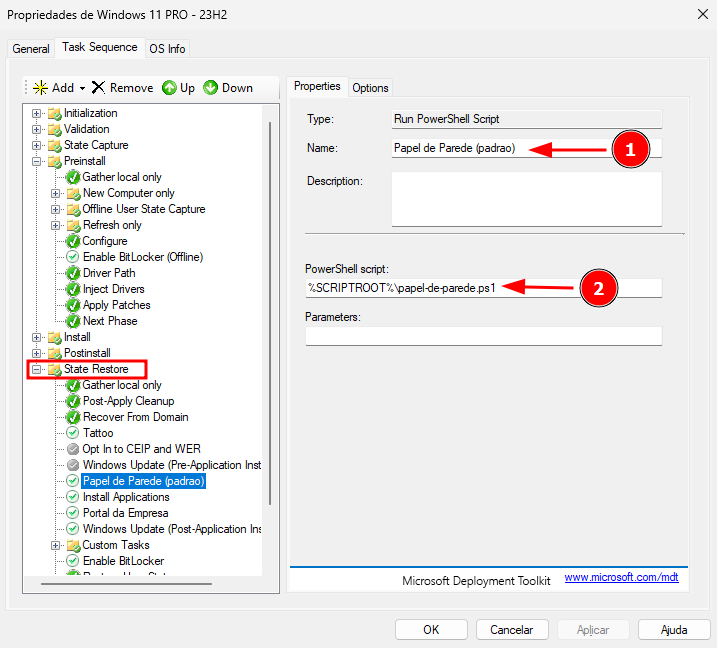
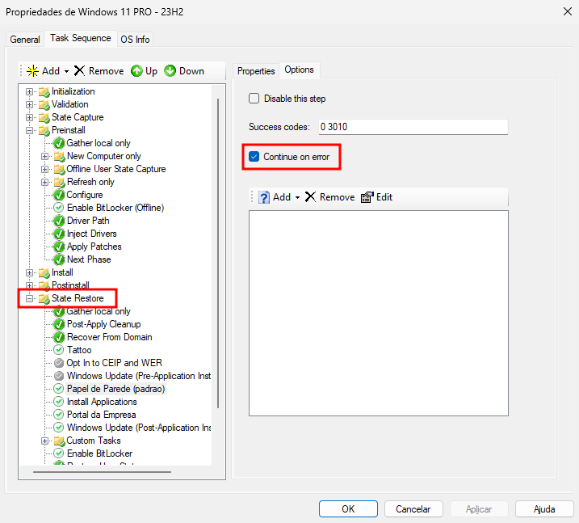

# 🖼️ Definir Papel de Parede durante o Deploy

Este documento tem como objetivo customizar a identidade visual dos dispositivos durante o processo de implantação, definindo um papel de parede padrão por meio de scripts automatizados.

---

## 📁 Estrutura Sugerida

```plaintext
DeploymentShare$
├── Scripts
│   └── Wallpapers
│       ├── wallpaper.jpg
└── papel-de-parede.ps1
```

---

## 🧰 Script PowerShell Exemplo: `papel-de-parede.ps1`

```powershell
# Caminho da imagem a ser usada
$Imagem = "$env:SystemRoot\Web\Wallpaper\wallpaper.jpg"

# Copia o papel de parede para o caminho de destino
Copy-Item -Path "$PSScriptRoot\Wallpapers\wallpaper.jpg" -Destination $Imagem -Force

# Aplica para todos os usuários via Perfil Padrão (Default User)
$defaultUserHive = "HKU\DefaultUser"
reg load $defaultUserHive "C:\Users\Default\NTUSER.DAT" 2>$null

Set-ItemProperty -Path "Registry::$defaultUserHive\Control Panel\Desktop" -Name Wallpaper -Value $Imagem
Set-ItemProperty -Path "Registry::$defaultUserHive\Control Panel\Desktop" -Name WallpaperStyle -Value "10" # Preenchido
Set-ItemProperty -Path "Registry::$defaultUserHive\Control Panel\Desktop" -Name TileWallpaper -Value "0"

reg unload $defaultUserHive

# Aplica para o usuário atual também (caso queira testar)
Set-ItemProperty -Path "HKCU:\Control Panel\Desktop" -Name Wallpaper -Value $Imagem
RUNDLL32.EXE user32.dll,UpdatePerUserSystemParameters
```

---

## ⚙️ Adicionar à Task Sequence

1. No Deployment Workbench, edite a Task Sequence;
2. Vá até a fase **State Restore**;
3. Adicione uma nova etapa do tipo **Run PowerShell Script** e preencha os campos conforme descrito a seguir:
   - **Name**: Papel de Parede (padrao)  
   - **Powershell Script**: `%SCRIPTROOT%\papel-de-parede.ps1`
   - **Aba Options**: marque a opção Continue on error
     > Ao marcar esta opção, o deploy não será interrompido em caso de falha na execução da etapa.
<p align="center">  
  <kbd></kbd>  
</p>
<p align="center">  
  <kbd></kbd>  
</p>

---

## ⚠️ Observações Importantes

- A aplicação de papel de parede por meio de scripts foi substituída por abordagens mais diretas, como o uso de políticas de Grupo (GPO) ou ferramentas de gerenciamento moderno, como o Microsoft Intune.
- Este documento propõe uma abordagem simplificada para garantir que, ao final do processo de implantação da imagem do Windows — e antes do ingresso da máquina no domínio ou no Intune — seja exibido o papel de parede institucional da empresa, substituindo temporariamente o fundo padrão do sistema operacional.

---

## 🤝 Contribuições

Sinta-se à vontade para usar, adaptar e sugerir melhorias.  
Este repositório é um ponto de troca de experiências entre profissionais de TI.

> 🗓 Documento criado em: **24/06/2025**  
> 💼 **Licença:** [MIT](../../LICENSE)  
> 🙋‍♂️ **Autor:** [Jardel Santos](https://www.linkedin.com/in/jardel-santos-2012)

---

[Voltar para MDT](../README.md) | [Voltar para a página principal](../../README.md)
