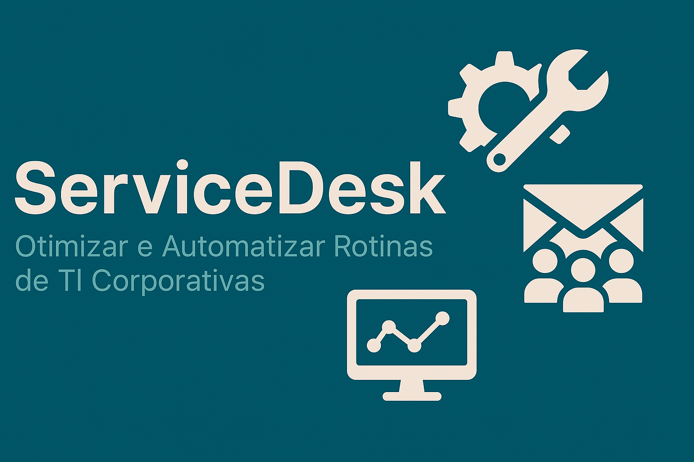

# 🛠️ Ferramentas para Suporte Corporativo

Este repositório foi criado com o objetivo de **compartilhar conhecimento prático** voltado à rotina de técnicos de suporte, analistas de TI e administradores de sistemas. Aqui você encontrará **scripts, automações e recursos** que podem ser aplicados em ambientes corporativos para:

- Otimizar tarefas repetitivas
- Reduzir tempo de atendimento
- Automatizar processos de instalação e diagnóstico
- Padronizar ambientes de TI

## 📂 Estrutura do Repositório

| Pasta            | Descrição                                                                 |
|------------------|---------------------------------------------------------------------------|
| `SystemInfo/`    | Script PowerShell com interface gráfica para coleta de informações do sistema do usuário. Ideal para uso em atendimento remoto. |
| `MDT/`           | Scripts e dicas relacionados ao **Microsoft Deployment Toolkit**, incluindo automações em imagens e pós-instalação. |
| `WSUS/`          | Documentos e automações para gerenciamento de atualizações via **WSUS**, incluindo limpeza e boas práticas. |
| `POS-IMAGEM/`    | Recursos para criação e manutenção de **imagens corporativas padronizadas**, focando em agilidade e consistência. |

## 🤝 Contribuições

Sinta-se à vontade para usar, adaptar e sugerir melhorias.  
Este repositório é um ponto de troca de experiências entre profissionais de TI.

> 💼 **Licença:** [MIT](LICENSE)  
> 🙋‍♂️ **Autor:** [Jardel Santos](https://www.linkedin.com/in/jardel-santos-2012)

