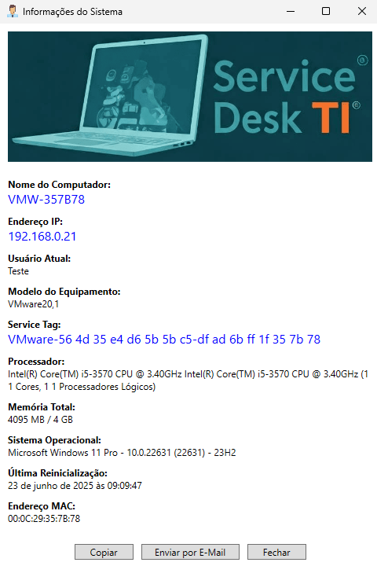

# 📊 SystemInfo - Informações essenciais sem complicação

Este script PowerShell exibe informações da estação de trabalho em uma interface gráfica amigável, ideal para equipes de Service Desk em empresas de pequeno e médio porte. É uma alternativa leve e rápida frente a ferramentas como *msinfo32*, *ipconfig* ou soluções RMM comerciais.

## 🧰 Informações Exibidas

- Nome do Computador  
- Endereço IP e MAC  
- Usuário Atual  
- Modelo do Equipamento  
- Service Tag (Serial Number)  
- Processador (nome, núcleos, threads)  
- Memória Total (em MB e GB)  
- Sistema Operacional (nome, versão, build)  
- Data da Última Reinicialização  

## 🖼️ Interface Gráfica

A interface foi criada utilizando XAML com WPF via .NET e apresenta botões úteis:

- **Copiar:** copia os dados para a área de transferência  
- **Enviar por E-mail:** abre o cliente de e-mail com os dados no corpo da mensagem  
- **Fechar:** encerra a janela  

<p align="center">  
  <kbd></kbd>  
</p>

O código é totalmente personalizável. É possível, por exemplo, implementar uma lógica que identifique automaticamente a rede atual com base na VLAN detectada — permitindo classificar se o equipamento está conectado à **rede corporativa**, **rede VPN** ou **rede externa** (como no caso de conexões domésticas). Esse recurso pode ser útil para aplicar diferentes lógicas de suporte ou alertas de conformidade de acordo com o ambiente de rede.

A imagem exibida na interface pode ser substituída e reposicionada conforme desejado dentro da janela.

Além disso, quando a última reinicialização do sistema tiver ocorrido há mais de **10 dias** (opção que também pode ser configurada), o campo correspondente será destacado em **vermelho**, reforçando a importância de reiniciar a máquina regularmente — prática essencial para aplicação de atualizações do Windows, políticas de segurança e correções pendentes.

## 🚀 Como Usar

1. Coloque os arquivos `.ps1`, `service-desk-ti.png` e `support-2.ico` em `C:\Users\Public\Documents`;  
2. Altere o atributo destes arquivos para `oculto`;  
3. Crie um atalho na Área de Trabalho Pública utilizando a linha de comando:  

```powershell
powershell.exe -ExecutionPolicy Bypass -WindowStyle Hidden -File "C:\Users\Public\Documents\SERVICEDESK.PS1"
```

> 💡 Ou crie via script:
> ```powershell
> $WshShell = New-Object -ComObject WScript.Shell
> $Shortcut = $WshShell.CreateShortcut("$env:PUBLIC\Desktop\SystemInfo.lnk")
> $Shortcut.TargetPath = "powershell.exe"
> $Shortcut.Arguments = '-ExecutionPolicy Bypass -WindowStyle Hidden -File "C:\Users\Public\Documents\SERVICEDESK.PS1"'
> $Shortcut.IconLocation = "C:\Users\Public\Documents\support-2.ico"
> $Shortcut.Save()
> ```

4. Execute o script (não é necessário executar como administrador).

> 🔐 *Dica:* pode ser necessário configurar a política de execução do PowerShell:  
> `Set-ExecutionPolicy RemoteSigned -Scope CurrentUser`

---

## 🎯 Finalidade e Contexto

### 🏢 Ambiente Corporativo com Service Desk

Imagine um cenário em que o suporte remoto é realizado via ferramentas como SCCM (System Center Configuration Manager). O sucesso da conexão depende da resolução correta entre **hostname** e **IP address**.

### ⚠️ O Problema

O serviço **DNS** pode demorar a refletir a atualização do novo IP, principalmente em ambientes com replicação lenta ou regras específicas de VPN. Isso dificulta ou inviabiliza o acesso remoto pelo nome da máquina, podendo redirecionar para outro computador.

### ✅ A Solução

Executando esse script localmente, o colaborador pode informar seu IP ao analista de suporte — agilizando o atendimento sem necessidade de comandos técnicos.

**Cenário Comum:**  
Trabalho híbrido com dois dias presenciais e uso de VPN nos demais. Em caso de erro após a conexão, o SCCM pode não refletir o IP atual da sessão VPN.

---

## 🛠️ Requisitos

- Windows 10 ou superior  
- PowerShell 5.1 ou mais recente  
- .NET Framework compatível com WPF (ex: 4.6+)  
- Permissão de leitura padrão para acesso ao WMI/CIM  
- Execução de scripts permitida no escopo do usuário  

---

## 🧪 Dica de Deploy

Considere criar um **instalador MSI** ou **script bat** para facilitar a distribuição em massa. Isso permite integração via **GPO**, **Microsoft Intune** ou outras soluções MDM, além de garantir consistência no deploy.

```batch
@echo off
setlocal ENABLEEXTENSIONS

:: === Configurações ===
set "SOURCE=\\SERVIDOR\TI\SystemInfo"
set "DEST=C:\Users\Public\Documents\SystemInfo"
set "DESKTOP_PUBLIC=C:\Users\Public\Desktop"
set "SCRIPT=SystemInfo.ps1"
set "ICON=support-2.ico"
set "LOG_DIR=C:\ProgramData\SystemInfo\Logs"

:: === Preparação ===
set "TIMESTAMP=%date:~6,4%-%date:~3,2%-%date:~0,2%_%time:~0,2%%time:~3,2%%time:~6,2%"
set "LOG_FILE=%LOG_DIR%\log-deploy-%TIMESTAMP%.txt"

:: Remove espaços da variável de tempo
set LOG_FILE=%LOG_FILE: =0%

:: Cria pasta de log se não existir
if not exist "%LOG_DIR%" (
    mkdir "%LOG_DIR%"
)

echo ==== INÍCIO DO DEPLOY: %date% %time% ==== >> "%LOG_FILE%"

:: Cria destino se necessário
if not exist "%DEST%" (
    mkdir "%DEST%" >> "%LOG_FILE%" 2>&1
    echo [OK] Criada pasta de destino: %DEST% >> "%LOG_FILE%"
)

:: === Copiando arquivos com xcopy ===
echo [INFO] Copiando arquivos de %SOURCE% para %DEST% >> "%LOG_FILE%"
xcopy "%SOURCE%\*.*" "%DEST%\" /E /H /R /Y /C >> "%LOG_FILE%" 2>&1

if %errorlevel% neq 0 (
    echo [ERRO] Falha na cópia dos arquivos. >> "%LOG_FILE%"
    goto FIM
) else (
    echo [OK] Arquivos copiados com sucesso. >> "%LOG_FILE%"
)

:: === Atributos ocultos ===
attrib +h "%DEST%\%SCRIPT%" >> "%LOG_FILE%" 2>&1
attrib +h "%DEST%\%ICON%" >> "%LOG_FILE%" 2>&1
attrib +h "%DEST%\service-desk-ti.png" >> "%LOG_FILE%" 2>&1
echo [OK] Atributos ocultos aplicados. >> "%LOG_FILE%"

:: === Criando o atalho na Área de Trabalho Pública ===
echo [INFO] Criando atalho >> "%LOG_FILE%"
powershell -Command ^
  "$WshShell = New-Object -ComObject WScript.Shell; ^
   $Shortcut = $WshShell.CreateShortcut('%DESKTOP_PUBLIC%\SystemInfo.lnk'); ^
   $Shortcut.TargetPath = 'powershell.exe'; ^
   $Shortcut.Arguments = '-ExecutionPolicy Bypass -WindowStyle Hidden -File \"%DEST%\%SCRIPT%\"'; ^
   $Shortcut.IconLocation = '%DEST%\%ICON%'; ^
   $Shortcut.Save()" >> "%LOG_FILE%" 2>&1

if exist "%DESKTOP_PUBLIC%\SystemInfo.lnk" (
    echo [OK] Atalho criado com sucesso. >> "%LOG_FILE%"
) else (
    echo [ERRO] Falha ao criar o atalho. >> "%LOG_FILE%"
)

:FIM
echo ==== FIM DO DEPLOY: %date% %time% ==== >> "%LOG_FILE%"
endlocal
exit /B
```

---

## 📦 Versão

**SystemInfo.ps1**  
Versão: `v1.0.0`  
Histórico de alterações disponível no changelog (em breve).

---

## 🧩 Complemento ao Suporte Remoto via GLPI e ITSM

Ferramentas de ITSM como o **GLPI** permitem integrar soluções de acesso remoto ao chamado — seja via plugins como **Tviewer** (que suportam TeamViewer, AnyDesk, VNC e outros) ou através de links personalizados embutidos no ticket. Esse tipo de integração agiliza o atendimento ao permitir que o analista inicie a sessão remota diretamente da interface da ferramenta.

Apesar disso, em muitos cenários a simples tentativa de conexão pode falhar por falta de informações precisas: nome da máquina desatualizado no DNS, IP dinâmico após reconexão via VPN ou erro de identificação no inventário.  

O **SystemInfo.ps1** atua justamente nesse ponto crítico: permite ao próprio colaborador, com um clique, obter os principais dados de sua estação (IP, hostname, sistema operacional etc.) e repassá-los rapidamente ao suporte.  

**Menos fricção, mais resolução.** E tudo isso sem depender de permissões administrativas ou instalação de agentes adicionais.

---

> ⚠️ **Ambiente restrito ao PowerShell? Sem problemas!**  
> Caso sua infraestrutura possua restrições quanto à execução de scripts PowerShell, existe uma alternativa igualmente simples e funcional: uma solução desenvolvida com **HTA (HTML Application)**. Com um duplo clique, o colaborador poderá obter as informações da máquina sem exigir permissões elevadas ou dependências adicionais. Para saber mais, consulte [SystemInfo em HTA](../hta/systeminfo-hta.md)
---

## 📦 Downloads

Seguem os pacotes compactados:

🔹 [Baixar systeminfo-powershell.zip](https://github.com/jardelsantos78/servicedesk/blob/main/systeminfo/powershell/SystemInfo-Powershell.zip)  
  Contém o script `.ps1`, imagens e ícone já prontos para deploy.

🔹 [Baixar systeminfo-hta.zip](https://github.com/jardelsantos78/servicedesk/blob/main/systeminfo/hta/SystemInfo-HTA.ZIP)  
  Versão alternativa em HTA (HTML Application) para ambientes restritivos ao PowerShell.

---

## 🤝 Contribuições

Sinta-se à vontade para usar, adaptar e sugerir melhorias.  
Este repositório é um ponto de troca de experiências entre profissionais de TI.

> 💼 **Licença:** [MIT](../LICENSE)  
> 🙋‍♂️ **Autor:** [Jardel Santos](https://www.linkedin.com/in/jardel-santos-2012)

---

[Voltar para a página principal](../README.md)
